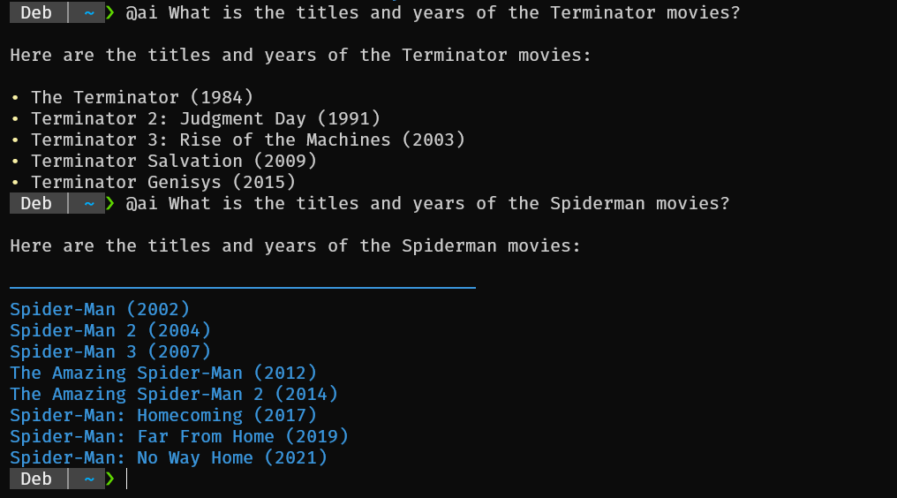

# CLI interface for Claude with ZSH / Zshell
Claude AI with ZSH, call using `@ai Hello Claude!`

- Uses Claude Haiku for fast response.
- `jq` for parsing JSON respons, grep fallback
- `--debug` to see raw response



## Install jq for JSON parsing
`sudo apt-get install jq`

## Download newest version
```bash
mkdir -p ~/bin && cd ~/bin
wget https://raw.githubusercontent.com/mheland/claude-zsh-cli/refs/heads/main/claude-cli
chmod +x claude-cli
```

## Add `bin` folder to path
```
echo "export PATH=\"$HOME/bin:\$PATH"\" >> ~/.zshrc
```

First run will ask for your Claude API key and store in `$HOME/.config/claude-cli/config`

## @AI alias and autocomplete in .zshrc
```
echo 'alias @ai="noglob claude-cli"' >> ~/.zshrc
echo 'compdef _gnu_generic @ai' >> ~/.zshrc
```

`noglob` so you can add a questionmark at the end

## Ain't workin?
Run with --debug ex 

`@ai --debug "Hello Claude!"`
